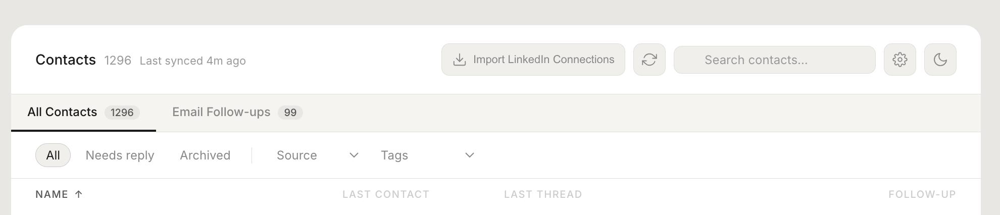

# Relvio

A local-first personal CRM that builds your contact list from Gmail. No cloud, no subscription, no data leaves your machine.

Track relationships, set follow-up reminders, monitor relationship health, and import LinkedIn connections — all from a single dashboard backed by a local SQLite database.



## Quickstart

```bash
git clone https://github.com/b-kifle/relvio.git
cd relvio
make install
make run
```

Open [http://localhost:5000](http://localhost:5000) and follow the setup wizard.

## Setup

The in-app setup wizard walks you through everything. You'll need:

1. **A Google Cloud project with the Gmail API enabled**
   - Go to [Google Cloud Console](https://console.cloud.google.com/)
   - Create a project (or use an existing one)
   - **APIs & Services > Library** — search "Gmail API" and enable it
   - **APIs & Services > Credentials** — create an **OAuth 2.0 Client ID** (Desktop app type)

2. **Paste your Client ID and Client Secret** into the setup page and click **Connect Gmail**

That's it. Relvio opens a Google sign-in page, you authorize read-only access, and your contacts start syncing.

## How it works

Relvio connects to your Gmail (read-only) and scans your inbox to identify real people you've exchanged emails with. It extracts names, email addresses, and conversation subjects, filtering out newsletters, notifications, and automated senders. Everything is stored in a local SQLite file (`crm.db`).

The dashboard lets you:
- **Tag contacts** by relationship (investor, classmate, advisor, etc.)
- **Set follow-up reminders** with overdue tracking
- **Monitor relationship health** — healthy, warm, cold, or dormant based on customizable time thresholds
- **Import LinkedIn connections** via CSV export
- **Search and filter** across all contacts
- **Track conversation threads** linked to each contact

Gmail syncs automatically in the background every 6 hours while the app is running.

## Privacy & Security

All data stays on your machine. No analytics, no telemetry, no external servers. The Gmail connection is read-only — Relvio cannot send emails or modify your inbox.

**Sensitive files that are generated locally and must never be shared or committed:**

- **`.env`** — contains your secret key and Google OAuth credentials. Treat it like a password file.
- **`token.json`** — contains your Gmail OAuth refresh token. Anyone with this file has read access to your Gmail. Never commit it. Never share it.

Both files are listed in `.gitignore` and will not be tracked by git.

## Requirements

- Python 3.10+
- A Google account

## Project structure

```
app.py                 Flask web server + all routes
contacts_extract.py    Gmail contact extraction pipeline
gmail_auth.py          OAuth2 authentication flow
templates/
  contacts.html        Main dashboard UI
  setup.html           First-run setup wizard
crm.db                 SQLite database (auto-created)
```

## Contributing

See [CONTRIBUTING.md](CONTRIBUTING.md).

## Bugs

Found a bug? [Open an issue](https://github.com/b-kifle/relvio/issues).

## License

[MIT](LICENSE)
